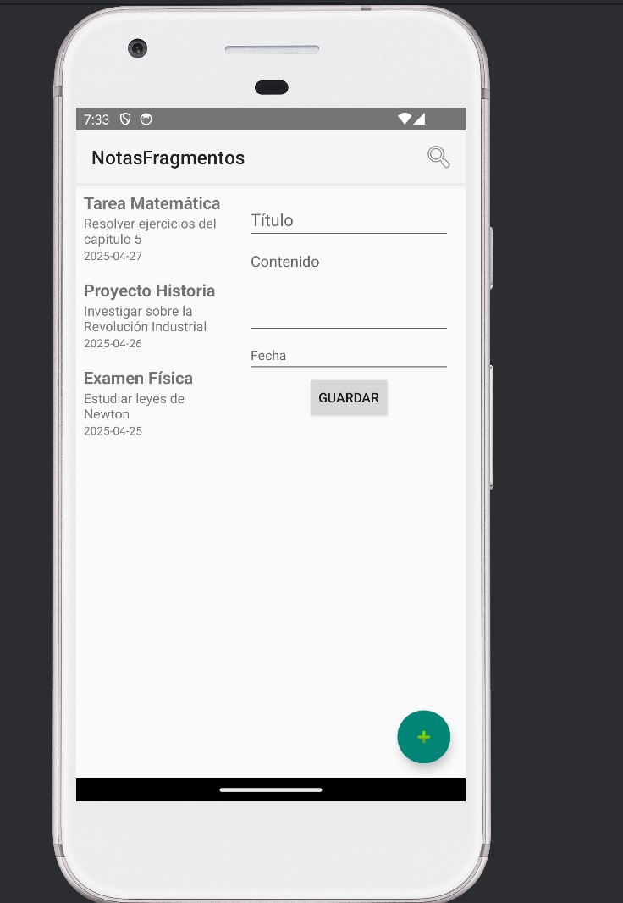

# NotasFragmentos 📒✨

Aplicación de notas desarrollada en **Android Studio** utilizando **Fragments**, **ViewModel** y **LiveData**.

## ✨ Funcionalidades principales
- Crear notas con título, contenido y fecha.
- Visualizar una lista de notas creadas.
- Editar y actualizar el contenido de una nota.
- Buscar notas por título o contenido en tiempo real.
- Regresar desde la vista de edición a la lista principal.

## 🛠️ Tecnologías utilizadas
- **Lenguaje**: Kotlin
- **IDE**: Android Studio Giraffe | Hedgehog
- **Arquitectura**: MVVM (Model-View-ViewModel)
  - ViewModel y LiveData
- **Componentes de UI**:
  - RecyclerView
  - Fragments
  - Material Design (botones, Snackbars)

## 📦 Estructura del proyecto
```plaintext
app/
 ├── java/com/example/notasfragmentos/
 │    ├── MainActivity.kt          # Controla los fragmentos y el ViewModel
 │    ├── NotasViewModel.kt        # Administra la lista de notas
 │    ├── ListaNotasFragment.kt    # Muestra todas las notas en un RecyclerView
 │    ├── DetalleNotaFragment.kt   # Permite editar o actualizar una nota seleccionada
 │    ├── NotasAdapter.kt          # Adaptador para el RecyclerView de las notas
 │    └── Nota.kt                  # Data class que representa una nota
 ├── res/layout/
 │    ├── activity_main.xml
 │    ├── fragment_lista_notas.xml
 │    ├── fragment_detalle_nota.xml
 │    ├── item_nota.xml
 └── res/menu/
      └── menu_main.xml
```
## 📸 Capturas de pantalla
### Pantalla principal


### Crear una nueva nota


### Editar una nota existente


### Búsqueda en tiempo real


## 🚀 Cómo ejecutar el proyecto
1. Clona el repositorio en tu máquina local:
   ```bash
   git clone <URL_DEL_REPOSITORIO>
   ```
2. Abre el proyecto en **Android Studio**.
3. Sincroniza el proyecto con Gradle (opción "Sync Now").
4. Conecta un emulador o dispositivo Android real.
5. Ejecuta (Run) la aplicación.

## 🔥 Características clave
- ✅ Añadir nuevas notas.
- ✅ Editar título, contenido y fecha de notas existentes.
- ✅ Guardar actualizaciones y reflejarlas en la lista.
- ✅ Botón "REGRESAR" para volver a la lista desde la edición.
- ✅ Búsqueda de notas en tiempo real.

## 👨‍💻 Autor
Proyecto desarrollado para la materia **Desarrollo de Aplicaciones Móviles Básicas**.

## 🧠 Nota
El proyecto utiliza un modelo básico de persistencia en memoria (las notas se pierden al cerrar la app).  
Es ideal para prácticas de:
- Arquitectura MVVM
- Manejo de Fragments
